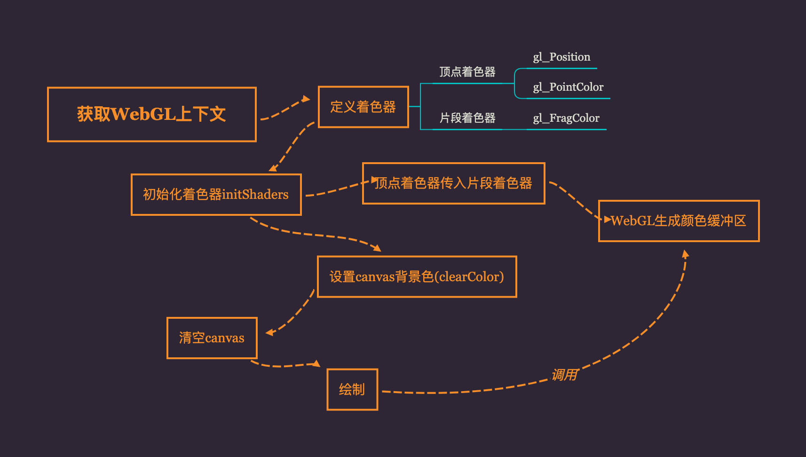

## 绘制一个点
WebGL使用着色器机制，我们使用一个最简单的例子，绘制一个点进行熟悉。
<details>
<summary>点击查看折叠代码块</summary>

```javascript
var VSHADER_SOURCE = 
  'void main() {\n' + // 使用\n换行可以定位错误位置
  '  gl_Position = vec4(0.0, 0.0, 0.0, 1.0);\n' + // Set the vertex coordinates of the point
  '  gl_PointSize = 10.0;\n' +         // Set the point size
  '}\n';
// Fragment shader program
var FSHADER_SOURCE =
  'void main() {\n' +
  '  gl_FragColor = vec4(1.0, 0.0, 0.0, 1.0);\n' + // Set the point color
  '}\n';
function main() {
  // Retrieve <canvas> element
  var canvas = document.getElementById('webgl');
  // Get the rendering context for WebGL
  var gl = getWebGLContext(canvas);
  if (!gl) {
    console.log('Failed to get the rendering context for WebGL');
    return;
  }
  // Initialize shaders
  if (!initShaders(gl, VSHADER_SOURCE, FSHADER_SOURCE)) {
    console.log('Failed to intialize shaders.');
    return;
  }
  // Specify the color for clearing <canvas>
  gl.clearColor(0.0, 0.0, 0.0, 1.0);
  // Clear <canvas>
  gl.clear(gl.COLOR_BUFFER_BIT);
  // Draw a point
  gl.drawArrays(gl.POINTS, 0, 1);
}
```
</details>
代码流程结构如下所示：


接下来我们根据代码流程进行GLSE基本说明。
## GLSE
### 着色器
由上述代码可以看出，着色器程序是以字符串形式“嵌入”在JavaScript文件中的，在程序运行前进行设置。WebGL需要一下两种着色器：

+ 定点着色器(Vertex shader)：描述顶点特性(如位置`gl_Position`、颜色`gl_PointSize`等)。
+ 片元着色器(Fragment shader)：进行逐片元（可理解为像素）处理过程的程序（如光照）,属性如`gl_FragColor`。

> 着色器运行在WebGL系统中，而不是JavaScript程序中

GLSE使用强类型进行变量定义。主要包括：

+ `float` 浮点数
+ `vec4` 四个浮点数组成的矢量。其中第四个参数被称为**齐次坐标**

::: tip
齐次坐标使用(x,y,z,w)进行描述，它等价于三维坐标(x/w,y/w,z/w)。所以当w为1时，效果与三维坐标相同。但如果w趋近于0，那么它所表示的点将趋近无穷远，从而实现了齐次坐标无穷的概念。它使得我们可以使用矩阵乘法来描述定点变换。
:::

### 初始化着色器
我们在上述代码中使用的初始化方法`initShader()`对原生方法进行了封装处理。具体实现如下
<details>
<summary>点击查看折叠代码块</summary>

```javascript
function initShaders(gl, vshader, fshader) {
  var program = createProgram(gl, vshader, fshader);
  if (!program) {
    console.log('Failed to create program');
    return false;
  }

  gl.useProgram(program);
  gl.program = program;

  return true;
}
function createProgram(gl, vshader, fshader) {
  // Create shader object
  var vertexShader = loadShader(gl, gl.VERTEX_SHADER, vshader);
  var fragmentShader = loadShader(gl, gl.FRAGMENT_SHADER, fshader);
  if (!vertexShader || !fragmentShader) {
    return null;
  }

  // Create a program object
  var program = gl.createProgram();
  if (!program) {
    return null;
  }

  // Attach the shader objects
  gl.attachShader(program, vertexShader);
  gl.attachShader(program, fragmentShader);

  // Link the program object
  gl.linkProgram(program);

  // Check the result of linking
  var linked = gl.getProgramParameter(program, gl.LINK_STATUS);
  if (!linked) {
    var error = gl.getProgramInfoLog(program);
    console.log('Failed to link program: ' + error);
    gl.deleteProgram(program);
    gl.deleteShader(fragmentShader);
    gl.deleteShader(vertexShader);
    return null;
  }
  return program;
}
```
</details>


