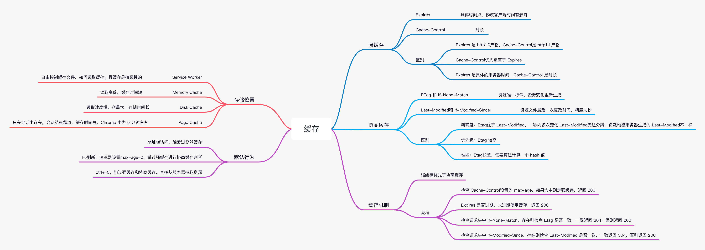

## 缓存
通过复用以前获取的资源，可以显著提高网站和应用程序的性能。Web 缓存减少了等待时间和网络流量，因此减少了显示资源表示形式所需的时间。通过使用 HTTP缓存，web 页面变得更具响应性。

### 缓存种类
缓存的种类有很多,其大致可归为两类：私有与共享缓存。共享缓存存储的响应能够被多个用户使用。私有缓存只能用于单独用户。
私有缓存如浏览器缓存，共享缓存如代理缓存，除此之外还有网关缓存、CDN、反向代理缓存和负载均衡器等部署在服务器上的缓存方式，为站点和 web 应用提供更好的稳定性、性能和扩展性。

#### (共享)代理缓存
共享缓存可以被多个用户使用。例如，ISP 或你所在的公司可能会架设一个 web 代理来作为本地网络基础的一部分提供给用户。这样热门的资源就会被重复使用，减少网络拥堵与延迟。

### 缓存操作目标
+ 一个检索请求的成功响应: 对于 GET请求，响应状态码为：200，则表示为成功。一个包含例如HTML文档，图片，或者文件的响应。
+ 永久重定向: 响应状态码：301。
+ 错误响应: 响应状态码：404 的一个页面。
+ 不完全的响应: 响应状态码 206，只返回局部的信息。
+ 除了 GET 请求外，如果匹配到作为一个已被定义的cache键名的响应。
### 缓存验证
缓存验证包含两种方式，强缓存和协商缓存，其中强缓存通过 `Cache-Control` 和 `Expires` 两个 http header 字段进行控制，协商缓存通过`Etag`和`If-None-Match`与`Last-Modified`和`If-Modified-Since`进行控制
#### 强缓存
##### Cache-Control头
|属性值|作用|
|---|---|
|no-store|不缓存，每次都重新请求|
|no-cache|缓存但重新验证|
|private|该响应是专用于某单个用户的，中间人不能缓存此响应，该响应只能应用于浏览器私有缓存中|
|public|响应可以被任何中间人（译者注：比如中间代理、CDN等）缓存|
|`max-age=<seconds>`|资源能够被缓存（保持新鲜）的最大时间,即距离请求发起的时间的秒数|
|must-revalidate|在考虑使用一个陈旧的资源时，必须先验证它的状态，已过期的缓存将不被使用|

##### Expires
语法`Expires: <http-date>`，其中`<http-date>`表示一个 HTTP-日期或时间戳，示例如下：
`Expires: Wed, 21 Oct 2015 07:28:00 GMT`

> 对比：Cache-Control优先级高于 Expires

#### 协商缓存
缺点

## 如何生成协商缓存

## 浏览器缓存机制
from memory cache
from disk cache
