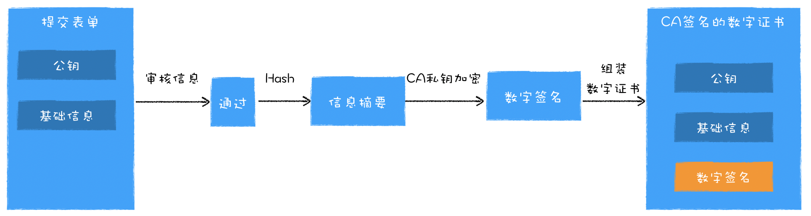
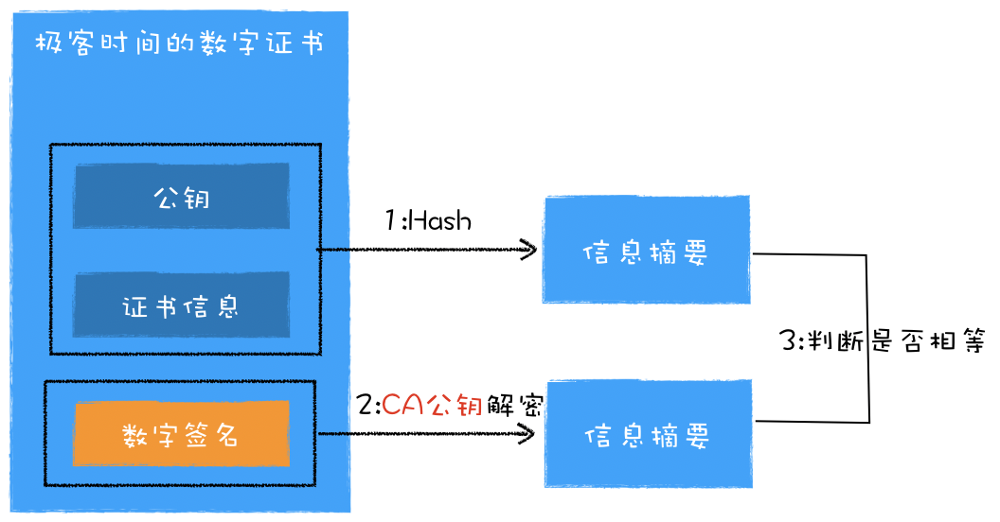
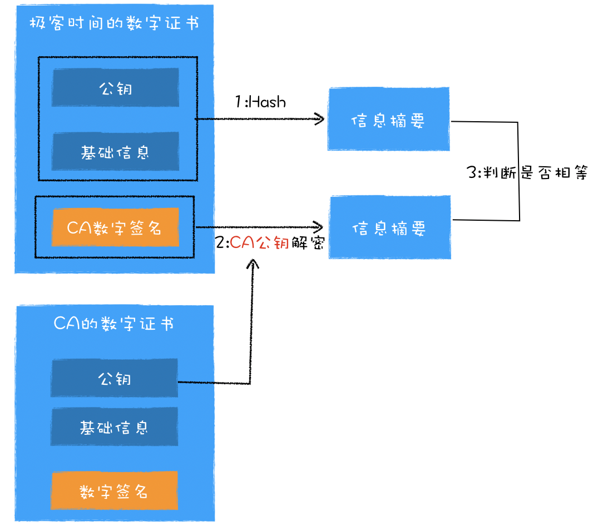
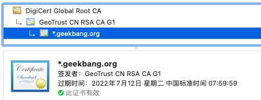

## HTTPS
常称为HTTP over TLS、HTTP over SSL或HTTP Secure
## 浏览器如何验证数字证书
### 数字证书申请流程
域名向一个 CA 机构申请数字证书，流程如下：
+ 机构管理员将包含域名身份信息的表单提交给 CA 机构，包括自己公钥、站点资料和公司资料等信息
+ CA 审核表单中内容真实性
+ 审核通过后，CA 机构拿出自己的私钥，对铭文资料进行 Hash 计算得出信息摘要，利用 CA 私钥加密信息摘要得出数字签名
+ 将数字签名写在表单，返回机构管理员

### 证书验证
浏览器验证证书具体包括三方面：
+ 证书的有效期
+ 证书是否被 CA 吊销
+ 证书是否是合法的 CA 机构颁发的

其中验证证书是否被吊销有两种方式，一种是下载吊销证书列表-CRL，第二种是在线验证-OCSP

对于验证数字证书是否是 CA 颁发的，验证流程为：
+ 浏览器利用证书的原始信息计算出信息摘要
+ 利用 CA 的公钥解密数字证书的数字签名，解密出来的数据也是信息摘要
+ 判断两个信息摘要是否相等

#### 浏览器获取 CA 公钥
浏览器可以通过两种方式获得 CA 公钥
1. 服务器部署的同时，部署 CA 机构的数字证书，证书包括了 CA 的公钥以及 CA 机构的一些基础信息
2. 通过网络下载，但会增加操作，减慢页面打开速度
因此，完整的验证流程如下：

### 数字证书链
CA 机构众多，因此操作系统不可能将每家 CA 的数字证书都内置进操作系统，因此，人们将颁发证书的机构分为两种：根 CA 和中间 CA。通常都是中间 CA 进行服务认证。由此形成了数字证书链

浏览器进行证书认证时，按照从下往上的顺序依次验证。当验证根证书的时候，则依据操作系统内置的证书列表进行判断。

如果想要成为根 CA，并让根证书内置到操作系统，机构需要通过 WebTrust 国际安全审计认证。