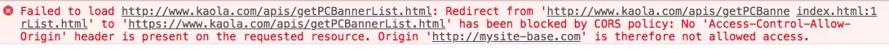

 ## 解决跨域
现在前端成熟的做法，一般是把`node proxy server`集成进来。事实上，用Nginx同样可以解决问题，甚至可以应用于线上。
本地起一个nginx server。`server_name`是`mysite-base.com`，比如现在需要请求线上`www.kaola.com`域下的线上接口 `www.kaola.com/getPCBanner` 的数据，当在页面里直接请求，浏览器会报错：



为了绕开浏览器的跨域安全限制，现在需要将请求的域名改成`mysite-base.com`。同时约定一个url规则来表明代理请求的身份，然后Nginx通过匹配该规则，将请求代理回原来的域。Nginx配置如下：
```nginx
#请求跨域，这里约定代理请求url path是以/apis/开头
location ^~/apis/ {
    # 这里重写了请求，将正则匹配中的第一个()中$1的path，拼接到真正的请求后面，并用break停止后续匹配
    rewrite ^/apis/(.*)$ /$1 break;
    proxy_pass https://www.kaola.com/;
}  
```
把请求url换成`http://mysite-base.com/apis/getPCBannerList.html` 。这样就可以正常请求到数据。这样其实是通过nginx，用类似于hack的方式规避掉了浏览器跨域限制，实现了跨域访问。

## 适配PC与移动环境
Nginx可以通过内置变量`$http_user_agent`，获取到请求客户端的userAgent，从而知道用户处于移动端还是PC，进而控制重定向到H5站还是PC站。
以笔者本地为例，pc端站点是`mysite-base.com`，H5端是`mysite-base-H5.com`。pc端Nginx配置如下：
```nginx
location / {
    # 移动、pc设备适配
    if ($http_user_agent ~* '(Android|webOS|iPhone|iPod|BlackBerry)') {
        set $mobile_request '1';
    }
    if ($mobile_request = '1') {
        rewrite ^.+ http://mysite-base-H5.com;
    }
}  
```
复制代码这样当浏览设备切换成移动模式，再次刷新页面后，站点被自动切换到H5站。

## 获取真实用户ip
nginx配置
```nginx
location / {
    proxy_set_header  Host $host;
    proxy_set_header  X-real-ip $remote_addr;
    proxy_set_header  X-Forwarded-For $proxy_add_x_forwarded_for;
}
```
+ `$remote_addr`获取到上一级代理的IP
+ `proxy_add_x_forwarded_for`获取到结果例如：(223.104.6.125, 10.10.10.45)，第一个是用户的真实IP，第二个是一级代理的IP，依此类推。

可以从`X-Forwarded-For`中取第一个值获取到真实用户ip。

## 图片防盗链
```nginx
server {
  listen       80;        
  server_name  *.sherlocked93.club;
  
  # 图片防盗链
  location ~* \.(gif|jpg|jpeg|png|bmp|swf)$ {
    valid_referers none blocked server_names ~\.google\. ~\.baidu\. *.qq.com;  # 只允许本机 IP 外链引用，感谢 @木法传 的提醒，将百度和谷歌也加入白名单
    if ($invalid_referer){
      return 403;
    }
  }
}
```
## 单页面history路由配置
```nginx
server {
  listen       80;
  server_name  fe.sherlocked93.club;
  
  location / {
    root       /usr/share/nginx/html/dist;  # vue 打包后的文件夹
    index      index.html index.htm;
    try_files  $uri $uri/ /index.html @rewrites;  
    
    expires -1;                          # 首页一般没有强制缓存
    add_header Cache-Control no-cache;
  }
  
  # 接口转发，如果需要的话
  #location ~ ^/api {
  #  proxy_pass http://be.sherlocked93.club;
  #}
  
  location @rewrites {
    rewrite ^(.+)$ /index.html break;
  }
}
```

##  HTTP 请求转发到 HTTPS
配置完 HTTPS 后，浏览器还是可以访问 HTTP 的地址 `http://sherlocked93.club/` 的，可以做一个 301 跳转，把对应域名的 HTTP 请求重定向到 HTTPS 上
```nginx
server {
    listen      80;
    server_name www.sherlocked93.club;

    # 单域名重定向
    if ($host = 'www.sherlocked93.club'){
        return 301 https://www.sherlocked93.club$request_uri;
    }
    # 全局非 https 协议时重定向
    if ($scheme != 'https') {
        return 301 https://$server_name$request_uri;
    }

    # 或者全部重定向
    return 301 https://$server_name$request_uri;

    # 以上配置选择自己需要的即可，不用全部加
}
```

## 泛域名路径分离
这是一个非常实用的技能，经常有时候我们可能需要配置一些二级或者三级域名，希望通过 Nginx 自动指向对应目录，比如：

`test1.doc.sherlocked93.club` 自动指向 `/usr/share/nginx/html/doc/test1` 服务器地址；
`test2.doc.sherlocked93.club` 自动指向 `/usr/share/nginx/html/doc/test2` 服务器地址；
```nginx
server {
    listen       80;
    server_name  ~^([\w-]+)\.doc\.sherlocked93\.club$;

    root /usr/share/nginx/html/doc/$1;
}
```