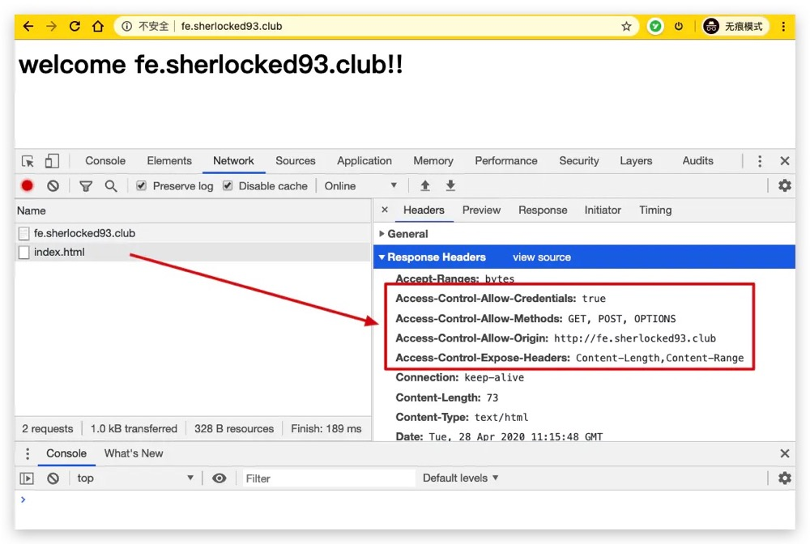

## 典型配置
```nginxå
user  nginx;                        # 运行用户，默认即是nginx，可以不进行设置
worker_processes  1;                # Nginx 进程数，一般设置为和 CPU 核数一样
error_log  /var/log/nginx/error.log warn;   # Nginx 的错误日志存放目录
pid        /var/run/nginx.pid;      # Nginx 服务启动时的 pid 存放位置

events {
    use epoll;     # 使用epoll的I/O模型(如果你不知道Nginx该使用哪种轮询方法，会自动选择一个最适合你操作系统的)
    worker_connections 1024;   # 每个进程允许最大并发数
}

http {   # 配置使用最频繁的部分，代理、缓存、日志定义等绝大多数功能和第三方模块的配置都在这里设置
    # 设置日志模式
    log_format  main  '$remote_addr - $remote_user [$time_local] "$request" '
                      '$status $body_bytes_sent "$http_referer" '
                      '"$http_user_agent" "$http_x_forwarded_for"';

    access_log  /var/log/nginx/access.log  main;   # Nginx访问日志存放位置

    sendfile            on;   # 开启高效传输模式
    tcp_nopush          on;   # 减少网络报文段的数量
    tcp_nodelay         on;
    keepalive_timeout   65;   # 保持连接的时间，也叫超时时间，单位秒
    types_hash_max_size 2048;

    include             /etc/nginx/mime.types;      # 文件扩展名与类型映射表
    default_type        application/octet-stream;   # 默认文件类型

    include /etc/nginx/conf.d/*.conf;   # 加载子配置项
    
    server {
    	listen       80;       # 配置监听的端口
    	server_name  localhost;    # 配置的域名
    	
    	location / {
    		root   /usr/share/nginx/html;  # 网站根目录
    		index  index.html index.htm;   # 默认首页文件
    		deny 172.168.22.11;   # 禁止访问的ip地址，可以为all
    		allow 172.168.33.44； # 允许访问的ip地址，可以为all
    	}
    	
    	error_page 500 502 503 504 /50x.html;  # 默认50x对应的访问页面
    	error_page 400 404 error.html;   # 同上
    }
}
```

## header配置
```nginx
server {
  listen       80;
  server_name  be.sherlocked93.club;
  
	add_header 'Access-Control-Allow-Origin' $http_origin;   # 全局变量获得当前请求origin，带cookie的请求不支持*
	add_header 'Access-Control-Allow-Credentials' 'true';    # 为 true 可带上 cookie
	add_header 'Access-Control-Allow-Methods' 'GET, POST, OPTIONS';  # 允许请求方法
	add_header 'Access-Control-Allow-Headers' $http_access_control_request_headers;  # 允许请求的 header，可以为 *
	add_header 'Access-Control-Expose-Headers' 'Content-Length,Content-Range';
	
  if ($request_method = 'OPTIONS') {
		add_header 'Access-Control-Max-Age' 1728000;   # OPTIONS 请求的有效期，在有效期内不用发出另一条预检请求
		add_header 'Content-Type' 'text/plain; charset=utf-8';
		add_header 'Content-Length' 0;
    
		return 204;                  # 200 也可以
	}
  
	location / {
		root  /usr/share/nginx/html/be;
		index index.html;
	}
}
```
然后 `nginx -s reload` 重新加载配置。这时再访问 fe.sherlocked93.club/index.html 结果如下，请求中出现了我们刚刚配置的 Header：

