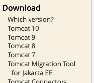
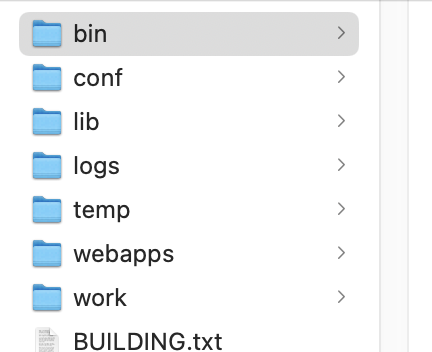
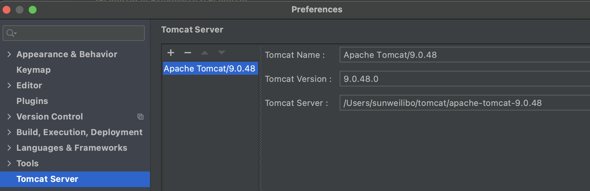

## 下载
打开 Tomcat 官网，选择要下载的版本



然后选择对应的包，tar.gz 类型是为 Mac 和 Linux 系统使用的，其他是 Windows 类型。

## 安装并启动
将压缩包存放至 /usr/local/tomcat 文件夹。

打开 Terminal，进入 Tomcat 所在目录的 bin 目录下

启动 Tomcat
```bash
./startup.sh
```
停止 Tomcat
```bash
./shutdown.sh
```

如果出现权限不够的问题，执行以下任一命令
```bash
chmod u+x *.sh
chmod 755 *.sh
```

## 配置
Tomcat目录结构如下


```
1> bin:存放tomcat命令

2> conf:存放tomcat配置信息,里面的server.xml文件是核心的配置文件

3> lib:支持tomcat软件运行的jar包和技术支持包(如servlet和jsp)

4> logs:运行时的日志信息

5> temp:临时目录

6> webapps:共享资源文件和web应用目录

7> work:tomcat的运行目录.jsp运行时产生的临时文件就存放在这里
```

### 修改端口号
服务器默认端口是8080，如果想修改为其他端口，打开 config目录下的 `server.xml`，将Connector 标签的 port 属性设置为自定义的端口号：
```xml
<Connector port="8099" protocol="HTTP/1.1"
           connectionTimeout="20000"
           redirectPort="8443" />
```
重启服务生效

## 添加到 Idea 编辑器
输入 cmd+.进入偏好设置，搜索 tomcat，然后选择 Tomcat 放置的文件夹

