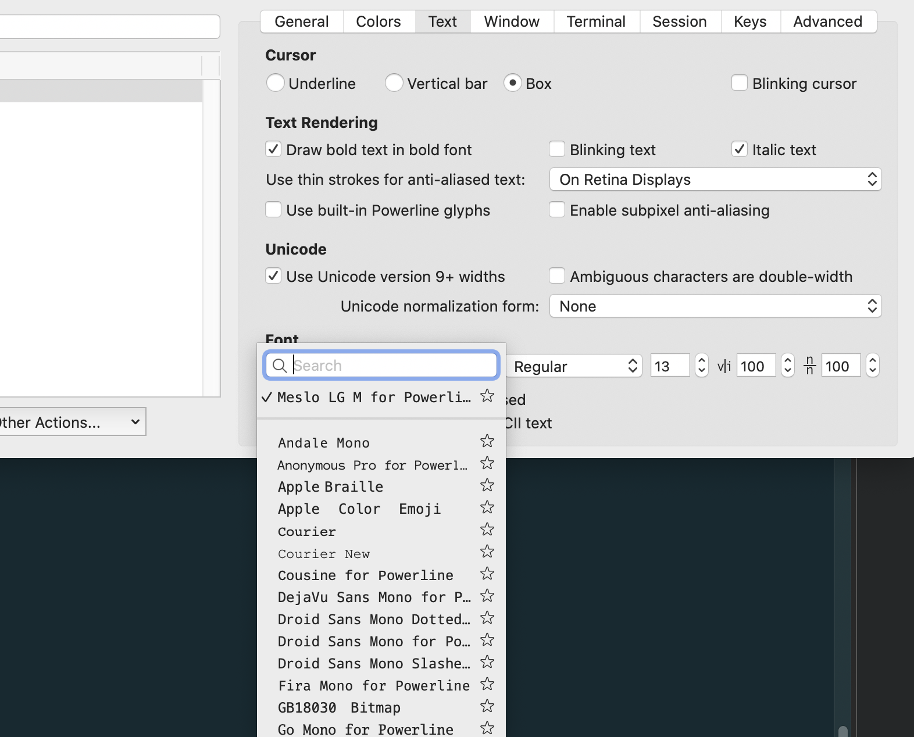
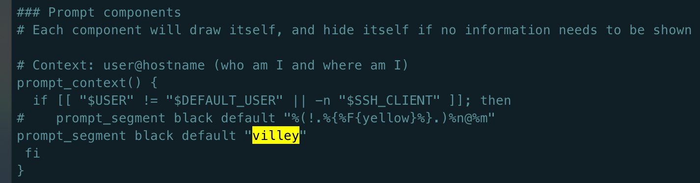

## 下载iterm2
可以从[官网地址](https://www.iterm2.com/index.html)进行下载

安装完成后，在/bin目录下会多出一个zsh的文件。
Mac系统默认使用dash作为终端，可以使用命令修改默认使用zsh：
```bash
chsh -s /bin/zsh
```
如果想修改回默认dash，同样使用chsh命令即可：
```bash
chsh -s /bin/bash
```

## 安装Oh my zsh
安装方法有两种，可以使用curl或wget，看自己环境或喜好：
### curl 安装方式
```bash
sh -c "$(curl -fsSL https://raw.githubusercontent.com/robbyrussell/oh-my-zsh/master/tools/install.sh)"
```
### wget 安装方式
```bash
sh -c "$(wget https://raw.githubusercontent.com/robbyrussell/oh-my-zsh/master/tools/install.sh -O -)"
```
## 安装PowerLine(agnoster用)
[powerline官网]http://powerline.readthedocs.io/en/latest/installation.html

安装powerline的方式依然简单，也只需要一条命令：
```bash
pip install powerline-status --user
```
没有安装pip的话使用命令安装pip即可：
```
sudo easy_install pip
```
### 安装PowerFonts
安装字体库需要首先将项目git clone至本地，然后执行源码中的`install.sh`。

在任意文件夹下执行git clone命令：
```bash
# git clone
git clone https://github.com/powerline/fonts.git --depth=1
# cd to folder
cd fonts
# run install shell
./install.sh
# 之后可以删除
..
rm -rf fonts
```
安装好字体库之后，我们来设置iTerm2的字体，具体的操作是iTerm2 -> Preferences -> Profiles -> Text，在Font区域选中Change Font，然后找到Meslo LG字体。有L、M、S可选，看个人喜好：


### 安装其他配色方案
配色方案在使用VIM或Colorful Log时会变得非常有用，同时界面也不会一片黑绿一样死板。

同样使用git clone的方式下载源码进行安装：
```bash
cd ~/Desktop/OpenSource
git clone https://github.com/altercation/solarized
cd solarized/iterm2-colors-solarized/
open .
```
在打开的finder窗口中，双击`Solarized Dark.itermcolors`和`Solarized Light.itermcolors`即可安装明暗两种配色：

再次进入iTerm2 -> Preferences -> Profiles -> Colors -> Color Presets中根据个人喜好选择这两种配色中的一种即可：

### 安装主题
下载agnoster主题，执行脚本安装：
```bash
cd ~/Desktop/OpenSource

git clone https://github.com/fcamblor/oh-my-zsh-agnoster-fcamblor.git

cd oh-my-zsh-agnoster-fcamblor/

./install
```
执行上面的命令会将主题拷贝到oh my zsh的themes中：

拷贝完成后，执行命令打开zshrc配置文件，将ZSH_THEME后面的字段改为`agnoster`,之后执行`source .zshrc`。

#### 更改主机名称
```bash
vi ~/.oh-my-zsh/themes/agnoster.zsh-theme
```
找到相应配置项进行修改即可

### 安装语法高亮插件
```bash
cd ~/.oh-my-zsh/custom/plugins/

git clone https://github.com/zsh-users/zsh-syntax-highlighting.git

vi ~/.zshrc
```
这时我们再次打开zshrc文件进行编辑。找到`plugins`，此时plugins中应该已经有了git，我们需要把高亮插件也加上：

**请务必保证插件顺序，`zsh-syntax-highlighting`必须在最后一个**。

然后在文件的最后一行添加：`source ~/.oh-my-zsh/custom/plugins/zsh-syntax-highlighting/zsh-syntax-highlighting.zsh`

执行`source ~/.zshrc`命令使刚才的修改生效。

### 可选择、命令补全
这也是一个zsh的插件，叫做`zsh-autosuggestion`，用于命令建议和补全。
```bash
cd ~/.oh-my-zsh/custom/plugins/

git clone https://github.com/zsh-users/zsh-autosuggestions

vi ~/.zshrc
```
找到plugins，加上这个插件即可.

有同学说补全命令的字体不太清晰，与背景颜色太过相近，其实可以自己调整一下字体颜色。

Preferences -> Profiles -> Colors 中有Foreground是标准字体颜色，ANSI Colors中Bright的第一个是补全的字体颜色。

或者在.zshrc中设置`ZSH_AUTOSUGGEST_HIGHLIGHT_STYLE='fg=244'`